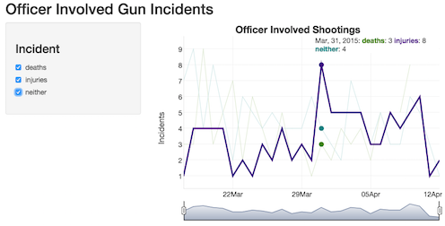
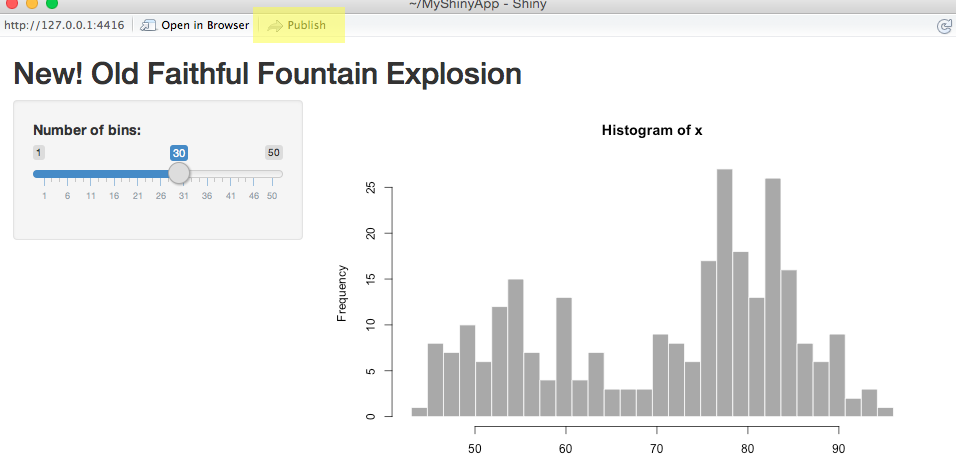

## Opening Credits

- Presentation Created with ioslides
- Using R Studio
- All the Source Code is Available Online<sup>*</sup>

<p align=right><sup>\*</sup>*You should still pay attention*</p>

## Goals

*You will...* 

- Publish a Shiny App Tonight
- Update Your App *(and be able to do that at your leisure)*
- Know Where to Find Information for Expanding Your App
- Be Able to Build New Apps
- See How Versatile, Shiny Really Is...
- Peek into the Future to See What Shiny Will Offer...

<br>

<p align=right>*...assuming the Internet God's allow it*</p>

## Shiny | What is it?

*It's simple!  Shiny is a...*

### **Framework for creating Web-based, Interactive, R Applications**
<div class="centered">

</div>
<hr>
<br>
*I could have darned my socks - is this how this is going to go?*

## Screenshot: Shiny Example

```{r, echo=FALSE, eval=FALSE}
# Turn this on for HTML
<div class="centered">


</div>
```

```{r, echo=FALSE, eval=TRUE}
# Turn this on for Shiny
inputPanel(
  selectInput(
    "n_breaks",
    label = "Number of bins:",
    choices = c(10, 20, 35, 50), selected = 20),
  
  sliderInput(
    "bw_adjust",
    label = "Bandwidth adjustment:",
    min = 0.2, max = 2, value = 1, step = 0.2)
)

renderPlot({
  hist(faithful$eruptions, probability = TRUE, breaks = as.numeric(input$n_breaks),
       xlab = "Duration (minutes)", main = "Geyser eruption duration")
  
  dens <- density(faithful$eruptions, adjust = input$bw_adjust)
  lines(dens, col = "blue")
})
```

## Why do I need it? | What problems does an interactive application (vs. static images) solve?

<div class="columns-2">

### Philanthropy / Altrusism

> - Train / teach others
> - Give back to the community
> - Start a dialog about an important topic
> - Allow others to research your dataset
> - Create a shared experience

### Self-Promotion / Ego

> - Improve your own Knowledge / Judgement
> - Develop Professional Contacts
> - Become *"FAMOUS"*
> - Show off a Novel Idea / Observation
> - Pursuade others with your data set

</div>

## Blather on about the Shiny App

- UI shields you from JS / CSS / HTML (*easy to build*)

> - UI and Server are built as separate functions (*simple to maintain*)
> - Based on Twitter Bootstrap (*it'll run on your phone*)
> - Requires a Shiny Server (*bummer*)
> - The example was **STOLEN** from <http://rmarkdown.rstudio.com/authoring_shiny.html>

## Source Code: UI
```{r, eval=FALSE}
inputPanel(
  selectInput(
###<b>
    "n_breaks",
###</b>
     label = "Number of bins:",
     choices = c(10, 20, 35, 50), selected = 20),
  
  sliderInput(
###<b>
    "bw_adjust",
###</b>
     label = "Bandwidth adjustment:",
     min = 0.2, max = 2, value = 1, step = 0.2)
)
```


## Available Inputs|I need to know what's possible

<http://shiny.rstudio.com/gallery/widget-gallery.html>


## Source Code: Server
```{r, eval=FALSE}
renderPlot({
  hist(faithful$eruptions, probability = TRUE,
###<b>
       breaks = as.numeric(input$n_breaks),
###</b>
       xlab = "Duration (minutes)", 
       main = "Geyser eruption duration")
###<b>
  dens <- density(faithful$eruptions, adjust = input$bw_adjust)
###</b>
  lines(dens, col = "blue")
})
```


# I. Mission: Publish a Shiny App


## Installation: Shiny

<http://shiny.rstudio.com/tutorial/lesson1/>

- Fire up **RStudio**
- Enter the following in the Console

```{r, eval=FALSE}

install.packages("shiny")
library(shiny)

runExample("01_hello")

```

## Publish Project|Start a New Project

<div class="columns-2">


- In your menu select **File**
- then **New Project...**

</div>

## Publish Project|New Directory

<div class="columns-2">

- Make a **New Directory** for your Project


</div>

## Publish Project|Shiny Web Application

<div class="columns-2">


- Create a **Shiny Web Application**

</div>

## Publish Project|Directory Name

<div class="columns-2">

- Setup your Project Directory Name
- The Click **Create Project**


</div>

## Publish Project|Magic Transformations

<div class="columns-2">

### A Lot Just Happened

- Your New Directory was Created
- Three New Files were Added
- Two Files *ui.R* and *server.R* were Created and Opened
- Open a Browser: <https://www.shinyapps.io/>
- You should see this --->


</div>

## Publish Project|Create ShinyApps.io Account

<div class="columns-2">

- If you have a Google or Github Account use it
- Otherwise, fill in the information and click *Sign Up*


</div>

## Publish Project|Verify Email

<br><br>

<div align=centered>

They'll send you an email and you have 72 hours to verify it.

</div>

<br><br>

<p align=right>*if you've never been through email verification
let me be the first to welcome you to the Internet...*</p>

## Pick Your Username

<div class="columns-2">

Here you might want to reflect as this will
**permanently**<sup>*</sup> become part of the URL that you 
will use to link to your applications.

\* *and by permanently I mean ephemeral because they'll let you change it later but don't 
because like my grandmother always said, "If you can't do something right the first time,
someone else will do it for you." or something like that...*

<div class="centered">


</div>

</div>

## Publish Project|Welcome Screen

<div class="centered">


</div>

<p align=right>...let's review the instructions to help you install **shinyapps**</p>

## Publish Project|Install ShinyApps

run the following in the Console window of RStudio...

```{r, echo=TRUE, eval=FALSE}

if (!require("devtools"))
###<b>
    install.packages("devtools")
###</b>

devtools::install_github("rstudio/shinyapps")

```

<p align=right>and then we'll authorize your account...</p>

## Publish Project|Authorize Account

Now that you have Shinyapps installed we need to link it with your account.

<dev class="centered">


</dev>

You'll need to cut-n-paste the appropriate code from the **Welcome Screen** into RStudio.
In most cases that means clicking **Copy to Clipboard** and then paste but it may mean 
showing the secret and copying the entire thing.

<p align=right>*...skip step 4 on the **Welcome Screen** deploying is much easier than that...*</p>

## Publish Project|Publish Button

Just look for the publish button in your RStudio window...


...or at the top of your running app...


## Publish Project|Deploy

<div class="columns-2">

Everything is probably filled in for you already.  You should see your
username and the fact that you are creating a new app selected.

The name of the app will be part of your URL so double-check that it's
representative of your application before sending it over.

to proceed click **Publish**


</div>

# Intermission

{Imagine Lively Music Playing in the Background...}

<p align=right>

</p>

## Review Your Handiwork

If all goes well - *and it doesn't always go well* - then you should
be reviewing your new Shiny app in your browser.  Play around with 
it a bit and be sure it does what you wish.

**Inevitably it won't - time to update things.**

# II. Mission: Updating Your Shiny App

*luckily this is much easier than setting up your account*

## Updating: Making Changes to Your Application

<div class="columns-2">


<br>


<br>

- ui.R and server.R tabs contain the respective files
- Change **titlePanel** or **label** values

<hr>

<br>

- When you're done, click the blue disk icon to **save** your changes
- Run your Application -> **Run App**

</div>

## Updating: Review Changes

<div class="centered">



</div>

## Updating: Publish Changes

<div class="centered">

Here's a screenshot of the initial publish window...


...notice that **Create New** has changed on your window and it now wants
to update your existing application...

Click **Publish**

</div>

#

*{**This Just In** Ralph, the wonder lama has been sacked}*

<iframe width="560" height="315" src="https://www.youtube.com/embed/O0wOD9TWynM" frameborder="0" allowfullscreen></iframe>

## What is a Shiny Server?|and why do I need it?

> - RStudio runs a FREE ONE! (*rockin!*)
> - ...you can't secure it and it only runs small apps... (*I can live with that*)
> - But you can install your own for FREE! (*Now We're Talking!*)
> - but you have to setup your own server (*hmmm...*)
> - and you still can't secure it (*fail*)
> - Of course they'll sell you one that can *($ $ $ $)*

## Review Our Goals

*You have...* 

- Built a New App
- Published a Shiny App
- Updated Your App

*Still Ahead...*

- Know Where to Find Information for Expanding Your App
- See How Versatile, Shiny Really Is...
- Peek into the Future to See What Shiny Will Offer...

<https://yxes.shinyapps.io/Shiny_Presentation/#33>

## Finding Information for Expanding Your App

- Reference Functions: <http://shiny.rstudio.com/reference/shiny/latest/>
- UI Widgets: <http://shiny.rstudio.com/gallery/widget-gallery.html>
- Example Gallery: <http://shiny.rstudio.com/gallery/>
- Tutorial: <http://shiny.rstudio.com/tutorial/lesson1/>
- Pretty Example: <http://shiny.rstudio.com/gallery/superzip-example.html>
- CheatSheet: <http://shiny.rstudio.com/articles/cheatsheet.html>

## Where can I find Shiny?|The Invasion

### Versatility

- R-Presentation Software:
  <https://yxes.shinyapps.io/Shiny_Presentation/>
- Stand-Alone Applications:
  <http://yxes.shinyapps.io/Capstone/>
- Your personal Blog if you use... &lt;iframe...&gt;&lt;/iframe&gt;:
  <https://www.statthis.com/>
- RMarkdown Files:
  <https://yxes.shinyapps.io/Officer_Involved_Shootings_Apr_2015/>

## The Future

- [HTML Widgets](http://www.htmlwidgets.org/)
- [New Themes](http://bootswatch.com/)
- [Shiny Dashboard](https://almsaeedstudio.com/preview)

## Links for this Presentation...

### This Presention
- Live: <http://yxes.shinyapps.io/Shiny_Presentation>
- HTML View: <https://yxes.github.com/Shiny_Presentation/>
- GitHub Source: <https://github.com/yxes/Shiny_Presentation>

### Officer Involved Shootings Example

- Github: <https://github.com/yxes/Officer_Involved_Shootings>
- Live: <http://yxes.shinyapps.io/Officer_Involved_Shootings_Apr_2015>